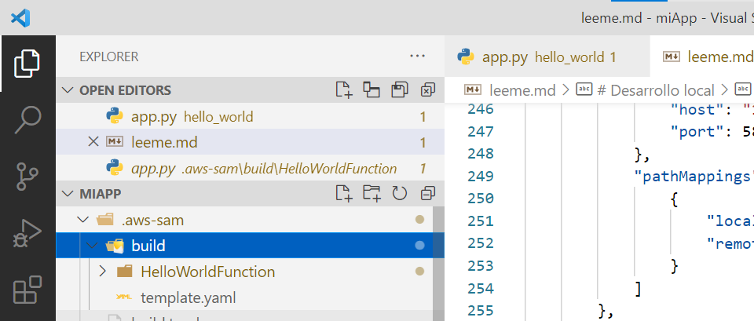
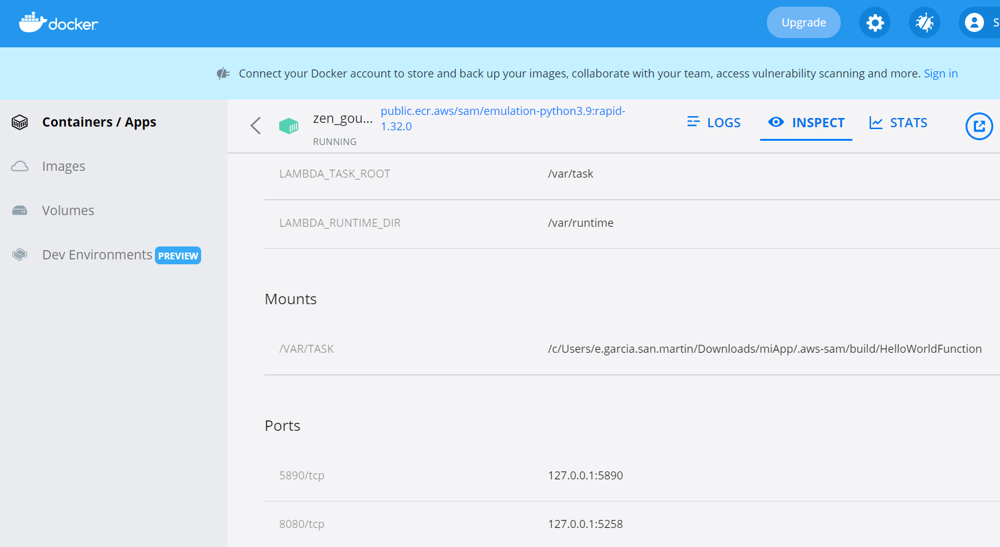
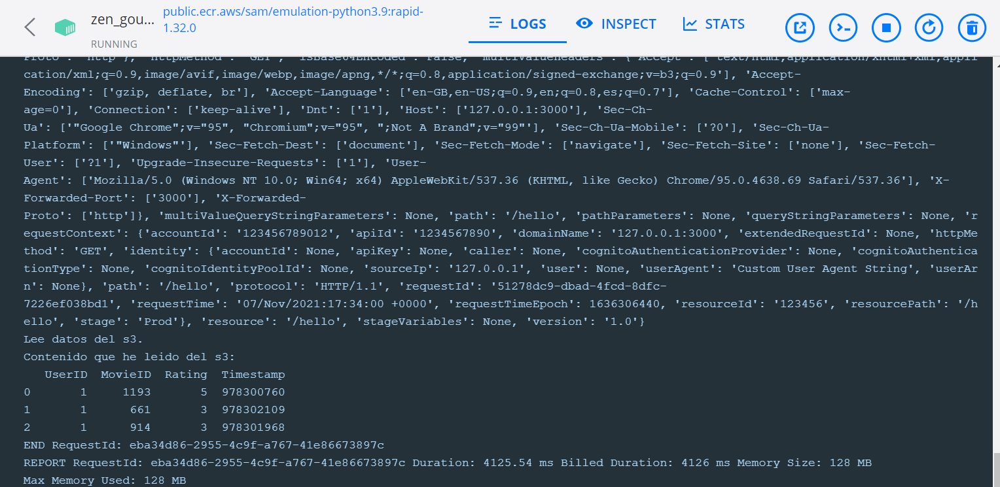
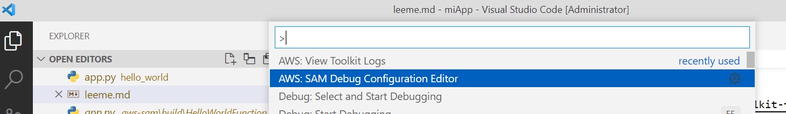

# Desarrollo local

## Empezando

Iniciamos una aplicación sam:

```ps
sam --init
```

Construimos la aplicación:

```ps
sam build
```

Desplegamos la aplicación usando el wizzard:

```ps
sam deploy --guided
```

Si hemos indicado que se cree un archivo de configuración `toml`, la siguiente vez que queramos desplegar bastará con hacer:

```ps
sam deploy

...
CloudFormation outputs from deployed stack
---------------------------------------------------------------------------------------------------------------------
Outputs
---------------------------------------------------------------------------------------------------------------------
Key                 HelloWorldFunctionIamRole
Description         Implicit IAM Role created for Hello World function
Value               arn:aws:iam::483497128006:role/miDebug-HelloWorldFunctionRole-AEGSTYZ2LMEO

Key                 HelloWorldApi
Description         API Gateway endpoint URL for Prod stage for Hello World function
Value               https://5g43r5nuf4.execute-api.eu-west-2.amazonaws.com/Prod/hello/

Key                 HelloWorldFunction
Description         Hello World Lambda Function ARN
Value               arn:aws:lambda:eu-west-2:483497128006:function:holaMundo
```

Ejecutamos la lambda:

```ps
aws lambda invoke --function-name holaMundo salida.txt
{
    "StatusCode": 200,
    "ExecutedVersion": "$LATEST"
}
```

Arrancamos un apigw local:

```ps
sam local start-api

Mounting HelloWorldFunction at http://127.0.0.1:3000/hello [GET]
You can now browse to the above endpoints to invoke your functions. You do not need to restart/reload SAM CLI while working on your functions, changes will be reflected instantly/automatically. You only need to restart SAM CLI if you update your AWS SAM template
2021-11-02 07:05:25  * Running on http://127.0.0.1:3000/ (Press CTRL+C to quit)
```

Llamamos a la lambda en local usando como entrada un evento con payload guardada en el archivo `events/event.json`:

```ps
sam local invoke "holaMundo" -e events/event.json

Invoking app.lambda_handler (python3.8)
Skip pulling image and use local one: public.ecr.aws/sam/emulation-python3.8:rapid-1.32.0.

Mounting C:\Users\e.garcia.san.martin\Downloads\miApp\.aws-sam\build\HelloWorldFunction as /var/task:ro,delegated inside runtime container
START RequestId: d1046b21-5493-4028-9eb3-43e4646f80c9 Version: $LATEST
END RequestId: d1046b21-5493-4028-9eb3-43e4646f80c9
REPORT RequestId: d1046b21-5493-4028-9eb3-43e4646f80c9  Init Duration: 0.17 ms  Duration: 134.87 ms     Billed Duration: 135 ms Memory Size: 128 MB     Max Memory Used: 128 MB
{"statusCode": 200, "body": "{\"message\": \"hello world\"}"}
```

Podemos crear un evento custom:

```ps
sam local generate-event apigateway aws-proxy --body='' --path='hello' --method GET > mievento.json
```

Se puede llamar también con `stdin`:

```ps
echo '{"message": "Hey, are you there?" }' | sam local invoke --event - "Ratings"
```

## Variables de entorno

Podemos especificar las variables de entorno que se usaran en la ejecución local:

```ps
sam local invoke --env-vars env.json
```

Donde `env.json` es un archivo que contiene las variables de entorno. Puede tener dos formatos. Si queremos definir variables diferentes según la lambda:

```json
{
    "MyFunction1": {
        "TABLE_NAME": "localtable",
        "BUCKET_NAME": "testBucket"
    },
    "MyFunction2": {
        "TABLE_NAME": "localtable",
        "STAGE": "dev"
    }
}
```

si por el contrario los parámetros serán los mismos para todas las lambdas:

```json
{
"Parameters": {
    "TABLE_NAME": "localtable",
    "BUCKET_NAME": "testBucket",
    "STAGE": "dev"
    }
}
```

## Api Gateway

Dentro del directorio donde tenemos la aplicación, hacemos:

```ps
sam local start-api
```

SAM identificará todos los recursos que tengamos en `template.yaml` registrados como `HttpApi` o `Api`.

```yaml
      Events:
        HelloWorld:
          Type: Api
          Properties:
            Path: /hello
            Method: get
```

Tambien podemos especificar el valor de las variables de entorno al arrancar la api usando el argumento `--env-vars`:

```ps
sam local start-api --env-vars env.json
```

## Test automatizados (integrados)

Pudemos levantar las lambdas para lanzar una prueba integrada:

```ps
sam local start-lambda
```

Para hacer que un test integrado utilice esta versión local de lambda:

```py
running_locally = True

if running_locally:
    lambda_client = boto3.client('lambda',region_name="us-west-2",
        endpoint_url="http://127.0.0.1:3001",
        use_ssl=False,
        verify=False,
        config=botocore.client.Config(
            signature_version=botocore.UNSIGNED,
            read_timeout=1,
            retries={'max_attempts': 0},
        )
    )
else:
    lambda_client = boto3.client('lambda')
```

## Generar Eventos

```ps
sam local generate-event [SERVICE] --help
```

Por ejemplo:

```ps
sam local generate-event s3 put

sam local generate-event s3 delete
```

## Libera recursos

Liberamos los recursos:

```ps
aws cloudformation delete-stack --stack-name miDebug --region eu-west2
```

## Depurar

### Remoto

Usamos la librería `debugpy` para depurar en remoto. En la lambda incluimos:

```py
import debugpy
debugpy.listen(("0.0.0.0", 5890))
print('Esperando a que se conecte un cliente')
debugpy.wait_for_client()
print('Se conecto')

def lambda_handler(event, context):
    ...
```

Por un lado hacemos que en la lambda se abra un puerto para permitir que el depurador de visual code se conecte en el puerto `5890`. El host indicamos que sea `0.0.0.0` porque al estar la lambda dentro de la imagen de docker al indicar `0.0.0.0` atendemos a cualquiera de las ips de la imagen.

Hemos usado `debugpy.wait_for_client()`, pero al ser un long running, no habría hecho falta, la lambda no va a terminar de ejecutarse antes de que el depurador se conecte.

Con esto nuestro código esta listo para permitir que el depurador de visual code se conecte. Para arrancar la depuración hacemos:

```ps
sam local start-api -d 5890 --host 0.0.0.0 --debug --warm-containers LAZY
```

Al especificar `--warm-containers` logramos que la imagen se mantenga después de atender una petición a la lambda - reforzando lo que acabo de comentar sobre `debugpy.wait_for_client()`. Con la opción `LAZY` la imagen se crea solo cuando se recibe la petición. La otra opción sería:

```ps
sam local start-api -d 5890 --host 127.0.0.1 --debug --warm-containers EAGER
```

Con esta opción la imagen se crea antes de ser invocada la primera vez.

La configuración en el visual code para conectarse en remoto y depurar es:

```json
        {
            "name": "Conexion Remota",
            "type": "python",
            "request": "attach",
            "connect": {
                "host": "127.0.0.1",
                "port": 5890
            },
            "pathMappings": [
                {
                    "localRoot": "${workspaceFolder}/.aws-sam/build/HelloWorldFunction",
                    "remoteRoot": "/var/task"
                }
            ]
        },
```

Hemos especificado el puerto y el host en el que vamos a conectarnos, que obviamente tiene que coincidir con el que hemos especificado con el `sam cli`. Por otro lado tenemos que especificar como `localRoot` la ruta en la que sam compila la aplicación.



Podemos [ver más propiedades en](https://docs.aws.amazon.com/toolkit-for-vscode/latest/userguide/serverless-apps-run-debug-config-ref.html) y [en este site](https://docs.aws.amazon.com/toolkit-for-vscode/latest/userguide/debug-apigateway.html).

Podemos ver en el contenedor de docker los siguientes detalles:



- Podemos ver como se ha mapeado `/var/task` con la ruta en la que sam ha construido la imagen, `${workspaceFolder}/.aws-sam/build/HelloWorldFunction`
- También observamos que la imagen expone el puerto `5890`

Podemos ver en la imagen de docker el log de la ejecucion:



### Depurar con el visual code

Podemos depurar una llamada con el visual code - es decir, en lugar de attachar el depurador de visual code, lanzar la ejecución y depurarla. Tenemos una utilidad con la extensión que nos permite configurar estas propiedades . Con esta opción no podemos usar _warmup images_.
